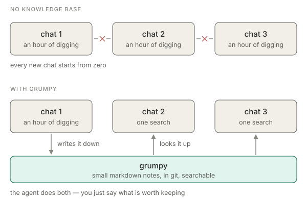

<div align="center">

<h1>Grumpy</h1>

**Your AI coding agent starts every chat with amnesia. This is where it keeps notes.**

[](https://www.python.org/downloads/)
</br>
[繁體中文](README.zh-TW.md) · [Quick start](#quick-start) · [How you actually use it](#how-you-actually-use-it) · [Commands](#commands) · [Advanced](docs/advanced.md)

</br>

</div>

## The problem

You spend an hour with your agent working out why the build breaks. Next week,
new chat, same question — and it works the whole thing out from scratch. Again.

The usual fix is a `notes.md` that grows until reading it costs more than the
answer, so nobody reads it — including the agent.

grumpy keeps the notes small enough to stay worth reading:

- One note answers one question, in about half a page.
- Search hands back the answer, not a wall of text.
- Notes link to each other, so finding one leads you to the rest.
- Solved things stop showing up.



## Quick start

```bash
git clone https://github.com/ez945y/grumpy.git
./grumpy/grumpy.py init ~/my-notes --name my-notes --install
```

Restart Claude Code and you're done. `--install` registers the knowledge base as
a skill, so your agent finds it on its own — no setup in your project, nothing
to import.

## How you actually use it

Mostly you don't type grumpy commands. You talk to your agent:

> "Write that up in the knowledge base."

> "Check the knowledge base first — have we hit this before?"

> "What do we know about the deploy script?"

It runs the commands, writes the notes, and searches them next time. You just
say what's worth keeping.

## What a note looks like

A markdown file in a folder. That's the whole storage format.

```markdown
---
id: d-06w5t43c
title: Build fails on a clean clone until you run make env
kind: known-issue
status: open
tags: [known-issue, major]
links: [d-0f2xk91b]
---

`make build` dies on a missing .env. `make env` generates it from
1Password and has to run first. Not in the repo README.

## Discussion
2026-08-09: fixed on the CI image, still an issue locally.
```

Editable in any editor, greppable, diffable, merged by git like any other file.
No database, no server, nothing to keep running.

## Commands

You'll rarely need these, but they're there:

```bash
./grumpy.py search "why does the build fail"    # find something
./grumpy.py issues                              # open problems, worst first
./grumpy.py read n-0004 --context               # a note, plus what it links to
./grumpy.py add --title "..." --kind known-issue --tags major
./grumpy.py status n-0004 resolved              # close it
./grumpy.py discuss n-0004 -m "we should fix this properly"
./grumpy.py handoff n-0004                      # everything needed to act on it
```

`read --context` is the one worth knowing. The note tells you what's broken;
the context tells you what was decided about it and which workaround actually
works.

`handoff` is the one to hand an agent. It prints the task, every decision and
defect it links to quoted in full, and then — computed at that moment, stored
nowhere — each named repo's HEAD, its uncommitted files, and what is running.
The alternative is a HANDOFF.md maintained by hand, which rots the same way
every time: it records a present state that a later commit falsifies, and
nothing makes it wrong out loud. Anything that goes stale is therefore read at
handoff time rather than written down. The exception is policy, which cannot be
derived from a repo: put that in `handoff.rules` beside `grumpy.conf`, and set
`workspace` there so the repo section has somewhere to look.

## Why "grumpy"

Because it argues with you. A write that would junk up the collection —
a duplicate, an over-long note, a tag invented on the spot — gets turned down,
and it tells you why:

```
overlap with existing notes is 100%; the limit is 60%. Closest:
  100%  d-06w5t43c  Build fails on a clean clone until you run make env
```

That's the whole idea. The failure mode isn't too few notes, it's notes nobody
trusts, so bad writes get stopped at the door instead of cleaned up later.

## For developers

Python 3.11+, standard library only. Search is SQLite full-text search over the
files, rebuilt automatically when one changes. No embeddings, no vector store.

```bash
python3 -m unittest test_grumpy -v      # 150 tests
```

`grumpy.py` knows nothing about any particular project, so one clone can serve
several knowledge bases.

## More

- [docs/advanced.md](docs/advanced.md) — where the engine and base live, `--root`, note kinds, writing notes worth keeping
- [CHANGELOG.md](CHANGELOG.md) — what changed
- MIT licensed. See [LICENSE](LICENSE).

## Seeing the shape of it

`search --expand` walks the link graph one hop at a time, which answers "what
is next to this" and never answers "what shape is this area".

```bash
../grumpy/grumpy.py serve                              # browse it, live
../grumpy/grumpy.py graph --tag esp32                  # an outline, in the terminal
../grumpy/grumpy.py graph --repo anvil --html > g.html # a snapshot to hand someone
```

`serve` reads the base on every request, so it is never out of date: add a note
and reload. The static `--html` export cannot have that property and no care
would give it - a file is a snapshot, and a snapshot of something that changes
is wrong the moment it changes. Keep the export for handing to someone who has
nothing installed; use `serve` for yourself.

The default is text, and that is the lesson of the first version rather than a
convenience. It was drawn first as a node-link diagram, and that carried less
than the listing it was drawn from: truncated titles, positions meaning only
grid order, three encodings each needing a legend. The base is not a web. It is
a few map notes each carrying a string of threads, plus orphans - a forest, and
a forest drawn as a forest reads without a legend. Once it read properly it was
obviously an outline, and an outline belongs in the terminal.

It takes the same filters as `search` on purpose. This is search rendered
differently, not a second thing to learn, and there is deliberately no default
of everything: two hundred notes drawn whole is a hairball that answers
nothing.

Indent is what is linked from what, so the root of each tree is its map note.
Orphans get their own group at the end, because a note connected to nothing is
actionable: it is either misfiled or the signal that a map is missing.
Corrections are marked inline. Layout is deterministic, so the SVG can be
committed and reviewed in a diff like any other artifact.
