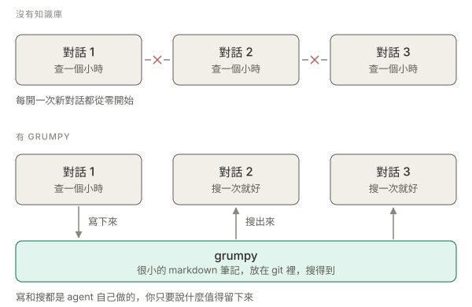

<div align="center">

<h1>Grumpy</h1>

**你的 AI coding agent 每開一個新對話就失憶。這是它的筆記本。**

[](https://www.python.org/downloads/)
</br>
[English](README.md) · [開始](#開始) · [實際上怎麼用](#實際上怎麼用) · [指令](#指令) · [進階](docs/advanced.zh-TW.md)

</br>

</div>

## 問題

你花了一小時跟 agent 一起搞懂 build 為什麼壞掉。下禮拜，開新對話，同一個問題，
它從零再推一次。然後再一次。

一般的解法是開一個 `notes.md`，它會一直長，長到讀完它比直接問還花時間，
於是沒人要讀 —— 包括 agent。

grumpy 讓筆記小到還值得讀：

- 一則筆記回答一個問題，大約半頁。
- 搜尋回給你答案，不是一大片文字。
- 筆記之間互指，找到一則就能連到其餘。
- 已經解決的不再出現。



## 開始

```bash
git clone https://github.com/ez945y/grumpy.git
./grumpy/grumpy.py init ~/my-notes --name my-notes --install
```

重開 Claude Code 就好了。`--install` 會把這個知識庫註冊成一個 skill，agent 自己
就找得到 —— 不用在你的專案裡設定什麼，也沒有東西要 import。

## 實際上怎麼用

大部分時候你不會自己打 grumpy 指令，你就是跟 agent 講話：

> 「把這次的結論記到 knowledge base。」

> 「先查一下 knowledge base，這個我們之前是不是踩過？」

> 「關於那個 deploy script，我們手上有什麼？」

它會自己下指令、自己寫、下次自己搜。你只要說什麼值得留下來。

## 一則筆記長怎樣

資料夾裡的一個 markdown 檔，整個儲存格式就這樣。

```markdown
---
id: d-06w5t43c
title: Build fails on a clean clone until you run make env
kind: known-issue
status: open
tags: [known-issue, major]
links: [d-0f2xk91b]
---

`make build` 會因為找不到 .env 而失敗。.env 是 `make env` 從 1Password
生出來的，必須先跑。repo 的 README 沒寫。

## Discussion
2026-08-09：CI image 上已經修掉了，本機還是會遇到。
```

任何編輯器都能改、grep 得到、git diff 看得懂，也像一般檔案一樣由 git 合併。
沒有資料庫、沒有伺服器、沒有要一直開著的東西。

## 指令

你不太會用到，但它們在這裡：

```bash
./grumpy.py search "why does the build fail"    # 找東西
./grumpy.py issues                              # 未解決的問題，最嚴重的在前
./grumpy.py read n-0004 --context               # 一則筆記，加上它連到的東西
./grumpy.py add --title "..." --kind known-issue --tags major
./grumpy.py status n-0004 resolved              # 結案
./grumpy.py discuss n-0004 -m "這個應該要好好修一下"
```

最值得記得的是 `read --context`。筆記告訴你什麼壞了，context 告訴你當初對它做了
什麼決定、哪一套繞法真的有效。

## 為什麼叫 grumpy

因為它會跟你吵。會把整包筆記弄髒的寫入 —— 重複的、太長的、標籤是臨時發明的 ——
它會當場拒絕，並且告訴你原因：

```
overlap with existing notes is 100%; the limit is 60%. Closest:
  100%  d-06w5t43c  Build fails on a clean clone until you run make env
```

這就是整個重點。真正的問題從來不是筆記太少，是筆記沒人信，所以爛的寫入是在門口
就擋掉，而不是先收下來以後再整理。

## 給開發者

Python 3.11+，只用標準函式庫。搜尋是直接對這些檔案跑 SQLite 全文檢索，檔案有變動
就自動重建。沒有 embedding、沒有向量資料庫。

```bash
python3 -m unittest test_grumpy -v      # 150 個測試
```

`grumpy.py` 不包含任何特定專案的資訊，所以 clone 一份可以服務好幾個知識庫。

## 更多

- [docs/advanced.zh-TW.md](docs/advanced.zh-TW.md) —— 引擎和知識庫放在哪、`--root`、筆記的六個類別、什麼樣的筆記值得留
- [CHANGELOG.md](CHANGELOG.md) —— 改了什麼
- MIT 授權，見 [LICENSE](LICENSE)。
