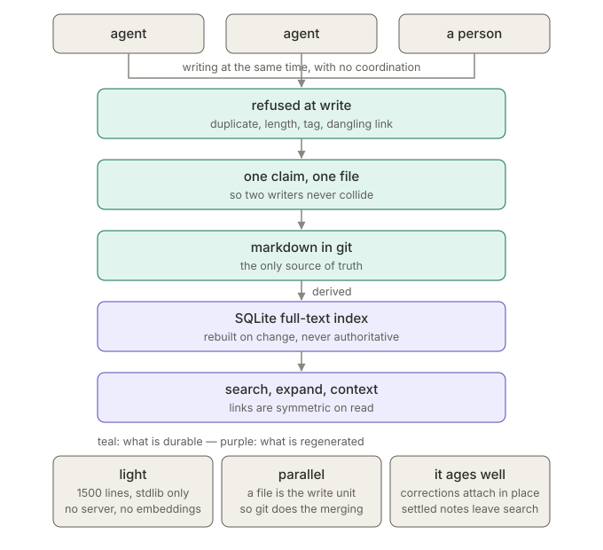

# Advanced

The details that would have made the [README](../README.md) twice as long.
[繁體中文](advanced.zh-TW.md)

## Where the engine lives

`init` creates a base holding knowledge only — `notes/`, `docs/`, `tags.md`,
`grumpy.conf`, `SKILL.md` — and leaves the engine where you cloned it, beside
the base rather than inside it:

```
~/work/
  grumpy/          <- this repo, cloned once
  team-kb/         <- knowledge only
  other-kb/
```

One clone serves every base on the box, a base you share with other people
carries knowledge rather than a vendored copy of a tool, and the base repo's
history stops filling with engine diffs.

Nothing stops you copying `grumpy.py` into a base to make it self-contained.
Both layouts work.

## Which base a command operates on

Most explicit first:

| | |
|---|---|
| `--root PATH` | wins over everything |
| `$GRUMPY_ROOT` | ambient default |
| the working directory | when it holds a `grumpy.conf` |
| the engine's own directory | a self-contained base, if you copied the engine in |

```bash
cd ~/work/team-kb && ../grumpy/grumpy.py search "the thing"
~/work/grumpy/grumpy.py --root ~/work/team-kb issues
```

## Installing into a skills directory

`./grumpy.py install` links an existing base into `~/.claude/skills/`, so Claude
Code and anything else that reads skills will find it. `--project` links it into
`./.claude/skills/` beside the code instead. Restart your agent tool afterwards
— the skill list is read once at startup.

The description at the top of the base's `SKILL.md` is the only thing deciding
whether an agent reaches for the knowledge base at all, so a vague one means it
never gets used. `tags.md` is worth a pass too — it's the list of areas notes
get filed under, and grumpy refuses tags that aren't in it.

## The six kinds

Every note is one of:

| kind | what it holds |
|---|---|
| `architecture` | how something is built |
| `known-issue` | something broken |
| `decision` | a choice, and why |
| `runbook` | steps that work |
| `reference` | a map or a table |
| `task` | outstanding work |

To choose between the first three, ask whether someone else doing the same work
would have written the same note. Always the same means the system is simply
like that, so it's architecture. Possibly different means someone made a call,
so it's a decision — and it has to say what the other options were.

## Overriding a refusal

Every gate takes `-f`. Use it when you've read what grumpy found and it's wrong
— genuinely separate notes that happen to share vocabulary, say. When you force
past a duplicate check, put the other note's id in this note's `links:` so the
pair stays connected.

## Linking notes

`link` adds links to a note that already exists:

```bash
./grumpy.py link n-0004 n-0009 n-0011
```

Reach for it when the thing you're describing has parts. Write the overview
first, listing the threads it has, then write each thread and link it on.
`add --links` can't express that order — ids are assigned at creation, so a note
can only cite what preceded it — and that order is the one worth encouraging,
because a thread nobody named is the one that gets left behind.

## Status, and not hand-editing frontmatter

```bash
./grumpy.py status n-0004 resolved
```

A `sed` over `status:` leaves the search index describing the old state until
someone remembers to reindex, and search is the whole point of the files.
`reindex` forces a rebuild if you've been editing by hand anyway.

## Writing notes worth keeping

The problem is never too few notes. It's notes nobody trusts.

Write down what you actually checked, and say whether you read it or ran it —
those are different levels of confidence. Skip anything the version history
would have told you anyway.

## Search

SQLite FTS5 over the note files, rebuilt automatically when one changes.
Queries the tokeniser can't split — Chinese among them — fall back to a
substring match.

## Architecture



The gates at the top are the unusual part; everything else follows from them.
A note is one file, which is why several people and agents can write at once and
git merges the result. The files are the only source of truth, so the index can
be thrown away and rebuilt. Corrections attach to the note they correct rather
than replacing it.

## Tests

```bash
python3 -m unittest test_grumpy -v      # 150 tests
```

Unit tests cover parsing, the tag tree, the link graph and the duplicate check.
End-to-end tests run the command itself. A last group checks the content next to
it: every label resolves, every link points at a real note, ids are unique. That
group skips when there's no content, so a fresh clone is green.
